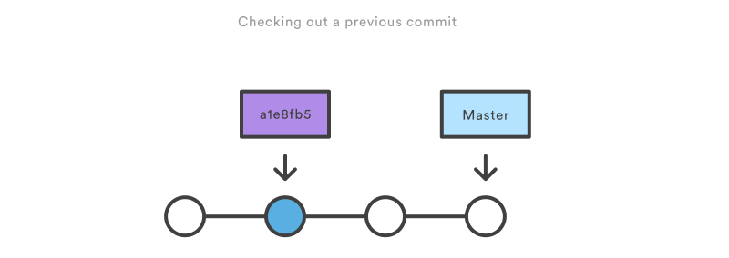

> ## Learning objectives {.objectives}
> * Be able to view history of changes to a repository
> * Be able to view differences between commits
> * Understand how and when to use tags to label commits

### Looking at differences

We forgot to reference a second paper in the introduction section.
Correct it, save the file but do not commit it yet.
We can review the changes that we made using:

~~~{.bash}
$ git diff journal.txt
~~~

This shows the difference between the latest copy in the repository and the
changes we made. 

* `-` means a line was deleted.  
* `+` means a line was added.  
* Note that a line that has been edited is shown as a removal of the old line and an
addition of the updated line.

Looking at differences between commits is one of the most common activities.
The `diff` command itself has a number of [useful
options](http://git-scm.com/docs/git-diff.html).

There is also a more elaborate front end to the `diff` command - [`git
difftool`](). `git difftool` is used for comparing and editing files that
changed between commits using common diff tools. There is a range of such
tools, including emerge, kompare, meld, and vimdiff.

There is a range of GUI-based tools supporting looking at differences and
editing files. For example:

* [Diffmerge](https://sourcegear.com/diffmerge/) (Free, cross-platform)
* [WinMerge](http://winmerge.org/) - open source tool available for Windows;
* GitHub [Compare
view](https://help.github.com/articles/comparing-commits-across-time)


The choice of GUI for viewing differences depends on the context in which you
are working and your own preferences related to choosing tools and
technologies.

Now commit the change we made by adding the second reference:
```{.bash}
$ git add journal.txt
$ git commit
```

### Looking at our history

To see the history of changes that we made to our repository (the most recent
changes will be displayed at the top):

~~~{.bash}
$ git log
~~~

The output shows: the commit identifier (also called revision number) which
uniquely identifies the changes made in this commit, author, date, and your
comment. *git log* command has many options to print information in various
ways, for example:

~~~{.bash}
$ git log --relative-date
~~~

Git automatically assigns an identifier (*COMMITID*) to each commit made to the
repository. In order to see the changes made between any earlier commit and our
current version, we can use  `git diff`  providing the commit identifier of the
earlier commit:

~~~{.bash}
$ git diff COMMITID
~~~

And, to see changes between two commits:

~~~{.bash}
$ git diff OLDER_COMMITID NEWER_COMMITID
~~~

Using our commit identifiers we can set our working directory to contain the
state of the repository as it was at any commit. So, let's go back to the very
first commit we made,

~~~{.bash}
$ git log 
$ git checkout COMMITID
~~~

We will get something like this:

~~~{.output}
Note: checking out '21cfbdec'.

You are in 'detached HEAD' state. You can look around, make experimental
changes and commit them, and you can discard any commits you make in this
state without impacting any branches by performing another checkout.

If you want to create a new branch to retain commits you create, you may
do so (now or later) by using -b with the checkout command again. Example:

  git checkout -b new_branch_name
  
HEAD is now at 21cfbde... Add title and authors
~~~

This strange concept of the 'detached HEAD' is covered in the next section ...
just bear with me for now!

If we look at `journal.txt` we'll see it's our very first version. And if we
look at our directory,

~~~{.bash}
$ ls
~~~
~~~{.output}
journal.txt
~~~


then we see that our `references` directory is gone. But, rest easy, while it's
gone from our working directory, it's still in our repository. We can jump back
to the latest commit by doing:

~~~{.bash}
$ git checkout master
~~~

And `references` will be there once more,

~~~{.bash}
$ ls
~~~
~~~{.output}
common journal.txt
~~~
So we can get any version of our files from any point in time. In other words,
we can set up our working directory back to any stage it was when we made
a commit.

### The *HEAD* and *master* pointers

*HEAD* is essentially a pointer which points to the branch at the commit where
you currently are. 
We said previously that *master* is the default branch. But *master* is
actually a pointer - that points to the tip of the master branch (the sequence
of commits that is created by default by Git). You may think of *master* as two
things: one as a pointer and one as the default branch. 

Before we checked out one of the past commits, the *HEAD* pointer was pointing to
*master* i.e. the most recent commit of the master branch. 
After checking out one of the past commits, *HEAD* was pointing to that commit i.e.
not pointing to master any more. 
That is what Git means by a 'detached HEAD' state and advises us that if we want to make a commit
now, we should create a new branch to retain these commits. 



If we created a new commit without first creating a new branch, i.e. working from
the 'detached HEAD' these commits would not overwrite any of our existing work,
but they would not belong to any branch. In order to save this work, we would need
to checkout a new branch. To discard any changes we make from the detached HEAD
state, we can just checkout master again.

### Using tags as nicknames for commit identifiers

Commit identifiers are long and cryptic. Git allows us to create tags, which
act as easy-to-remember nicknames for commit identifiers.

For example,

```{.bash}    
$ git tag PAPER_STUB
```

We can list tags by doing:

```{.bash}    
$ git tag
```

Now add a reference and commit the change:

```{.bash}    
$ gedit common/references.txt
$ git add references.txt 
$ git commit -m "..." references.txt
```

We can checkout our previous version using our tag instead of a commit
identifier.

```{.bash}    
$ git checkout PAPER_STUB
```

And return to the latest checkout,

```{.bash}    
$ git checkout master
```

> ##Top tip: tag significant events {.callout}
>
> When do you tag? Well, whenever you might want to get back to the exact
> version you've been working on. For a paper, this might be a version that has
> been submitted to an internal review, or has been submitted to a conference.
> For code this might be when it's been submitted to review, or has been
> released.

> ## Exercise: "bio" Repository {.challenge}
>
> - Create a new Git repository on your computer called "bio"
> - Write a three-line biography for yourself in a file called `me.txt`
> - Commit your changes
> - Modify one line, add a fourth line, then save the file
> - Display the differences between the updated file and the original

Previous: [Setting up a local repository](02-local.html) Next: [Advice on commits](04-commit-advice.html)
