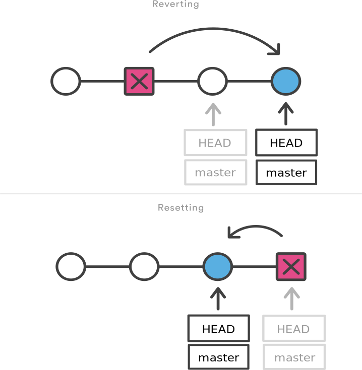

> ## Learning objectives {.objectives}
> * Be able to discard local changes
> * Be able to amend the most recent commit
> * Be able to discard all changes since a particular commit
> * Be able to undo the changes introduced by a commit

There are a number of things which we can amend and change after they have been
commited in Git.

### Discarding local changes

Maybe we made our change just to see how something looks, or to
quickly try something out. But we may be unhappy with our changes. If we
haven't get done a `git add` we can just throw the changes away and return
our file to the most recent version we committed to the repository by using:

```{.bash}
$ git checkout journal.txt
```

and we can see that our file has *reverted* to being the most up-to-date one in
the repository:

```{.bash}
$ git status
```

---

### Amending the most recent commit

If you just made a commit and realised that either you did it a bit too early
and the files are not yet ready to be commited. Or, which is not as uncommon as
you think, your commit message is not as it is supposed to be. You can fix that
using the command:

```{.bash}
$ git commit --amend
```

This opens up the default editor for Git which includes the previous commit
message - you can edit it and close the editor. This will simply fix the commit
message.

But what if we forgot to include some files in the commit?

Let's try it on our example. First, let's modify two files: our paper file and
the references file. We will add a methodology section to the paper where we
detail the instrumentation used, and add a reference for this to the references
file.

We should get something like this:
	
```{.bash}
$ git status 
```
```{.output}
$ On branch master 
Changes not staged for commit:
  (use "git add <file>..." to update what will be committed)
  (use "git checkout -- <file>..." to discard changes in working directory)

	modified:   common/references.txt
	modified:   journal.txt

no changes added to commit (use "git add" and/or "git commit -a")
```

Let's then add and commit `journal.txt` but not the references file.

```{.bash}
$ git add journal.txt 
$ git commit -m "Add methodology section"
```
	
Let's have a look what's up with our working directory now:

```{.bash}
$ git status
```
```{.output}
$ On branch master 
Changes not staged for commit: 
  (use "git add <file>..." to update what will be committed) 
  (use "git checkout --	<file>..." to discard changes in working directory)

	modified:   common/references.txt

no changes added to commit (use "git add" and/or "git commit -a")
```

Also, run `git log` to see what is the latest commit message and ID.

Now, we want to fix our commit and add the references file.

```{.bash}
$ git add common/references.txt 
$ git commit --amend
```

This will again bring up the editor and we can amend the commit message if required.

Now when we run `git status` and then `git log` we can see that our Working
Directory is clean and that both files were added. 

---

### `git reset --hard` (restore a previous state by deleting history)

`git reset` has several uses, and is most often used to unstage files from the staging
area i.e. `git reset` or `git reset <file>`.

We are going to use a variant `git reset --hard <commit>` to reset things to how 
they were at `<commit>`. This is a permanent undo which deletes all changes more recent
than `<commit>` from your history. There is clearly potential here to lose work, so use
this command with care.

Let's try it on our example. Modify the journal, describing which other instruments were
used, and then make a commit.
We now realise that what we've just done in our journal file is incorrect
because we are not using the data from that instrument.
Some of the data got corrupted, and due to problems with the logging computer
we are not going to use that data.
So it makes sense to abandon the commit completely.

We can do that by running:

```{.bash}
$ git reset --hard HEAD^
```

This moves the tip of the branch back to a previous commit. If we look in-depth, 
this command moves back 2 pointers: `HEAD` and the pointer to the tip of the
branch we currently are working on. (`HEAD^` = the commit right before HEAD;
`HEAD^^` = two commits before HEAD)

The final effect is what we need: we abandoned the commit and we are now back
to where we were before making the nonsense commit.

[This article](http://git-scm.com/2011/07/11/reset.html) discusses more in
depth `git reset` showing the differences between the three options:

* `--soft`
* `--mixed`
* `--hard`


> # Top tip: do not use `git reset` with remote branches {.callout}
> There is one important thing to remember about the `reset` command - it
> should only be used with branches that have not been shared yet (that is they
> haven't been pushed into a remote repository that others are using). Resetting
> is changing the history **without** leaving trace. This is always a bad practice
> when using remote repositories and can lead to a horrible mess.

So what can we do if we want to abandon changes in branches that are shared
with others? We need to use the `revert` command.

---

### `git revert` (undo changes associated with a commit)

`git revert` removes the changes applied in a specified commit. However, rather 
than deleting the commit from history, git works out how to undo those changes
introduced by the commit, and appends a new commit with the resulting content.

Let's try that our paper, using the same example as before:
add a line or two describing the instrument whose measurements we are no longer
able to use. Then add and commit. Once again we have a change we want to undo.

```{.bash}	
$ git revert HEAD
```

When we revert, a new commit is created. The `HEAD` pointer and the branch
pointer are in fact moved forward rather than backwards. 	
	
We can revert any previous commit. That is, we can "abandon" any of the
previous changes. However, depending on the changes we made, we may bump into
a *conflict* (which we will cover in more detail further on). 

```{.output}
error: could not revert 848361e... Describe Aerosol Mass Spectrometer
hint: after resolving the conflicts, mark the corrected paths
hint: with 'git add <paths>' or 'git rm <paths>'
hint: and commit the result with 'git commit'
```
	
Behind the scenes Git gets confused trying to merge the commit `HEAD` is pointing
to with the past commit we're reverting. 

Reverting thus records the fact of "abandoning the commit" in the history.
When we revert in a branch that is shared with others and then push that branch
into the remote repository, it is as if we "came clean" about what we were
doing. Everyone who pulls the branch in which we reverted changes will see it.
With `reset` we "keep it secret" that we have undone some changes.



See this [Atlassian online tutorial](
https://www.atlassian.com/git/tutorials/resetting-checking-out-and-reverting/commit-level-operations)
for further reading about the differences between `revert` and `reset`.

### How to undo almost anything with Git
See [this blog post](https://github.com/blog/2019-how-to-undo-almost-anything-with-git) for more example scenarios and how to recover from them.

Previous: [Branching, merging and resolving conflicts](05-branching.html) Next: [Rebasing](07-rebasing.html)
