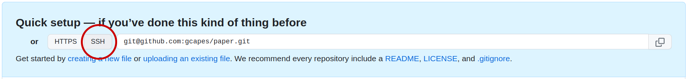

We're going to set up a remote repository that we can use from multiple
locations. The remote repository can also be shared with colleagues, if we want
to.

### GitHub

[GitHub](http://github.com) is a company which provides remote repositories for
Git and a range of functionalities supporting their use. GitHub allows users to
set up  their private and public source code Git repositories. It provides
tools for browsing, collaborating on and documenting code. GitHub, like other
services such as [Bitbucket](https://bitbucket.org) and [GitLab](https://about.gitlab.com/)
supports a wealth of resources to support projects including:

* Code download
* History of changes to repositories
* Browsing code from within a web browser, with syntax highlighting
* E-mail notifications
* Software release management
* Issue tracking (great for planning and discussing work)

**Note**  GitHub's free repositories have public licences **by default**. If
you don't want to share (in the most liberal sense) your stuff with the world
and you want to use GitHub, you can create a private repository, which is limited
to 3 collaborators for a free GitHub account.

> ## Are you already using GitHub?
> - If you're not already using GitHub (or similar) for your research code
>   what is holding you back? What concerns do you have?
> - If you've already taken the plunge, how did you overcome any concerns?
>
> > ## Some thoughts
> > - Your code isn't 'good enough' yet
> >   - Getting your code shared online is one of the best ways to improve it.
> >   - GitHub has some great tools for collaboration which will make it easier
> >     to get help from others (e.g. code review from a colleague) and
> >   - Having the history of changes and discussions all in one place makes it easier
> >     for someone else to build on your code (or vice versa)
> >   - The reality is code is nearly always a work-in-progress,
> >     so it's best to just get started wherever you're currently up to
> > - Who owns code in a public repo?
> >   - Keeping your code in a private repo will ensure that no-one can view it or use it
> >   - Even a public repo without a licence is covered by default copyright laws
> >   - However, adding a licence e.g. [MIT][MIT-licence] and [making a release][github-release]
> >     means others can use it but you would retain copyright for your work
> >   - <https://choosealicense.com/> is a good tool for deciding which licence is appropriate for you
> >   - You can also [release code with a DOI][citable-code] so that people can cite it in papers.
> {: .solution}
{: .discussion}

---

### Create a new repository

Now, we can create a repository on GitHub,

* Log in to [GitHub]
* Click on the **Create** icon on the top right
* Enter Repository name: "paper"
* For the purpose of this exercise we'll create a public repository
* Make sure that *Initialize this repository with a README* is **unselected**
* Click **Create Repository**

You'll get a page with new information about your repository. We already have
our local repository and we will be *pushing* it to GitHub **using SSH**,
so this is the option we will use:



```
$ git remote add origin git@github.com:<USERNAME>/paper.git
$ git push -u origin master
```
{: .language-bash}

> ## Authentication Errors
>
> If you get a warning that HTTPS access is deprecated, or a token is required,
> then you accidentally cloned the repository using HTTPS and not SSH.
> You can fix this from the command line by
> resetting the remote repository URL setting on your local repo:
>
> ~~~
> $ git remote set-url origin git@github.com:<YOUR_GITHUB_USERNAME>/paper.git
> ~~~
> {: .language-bash}
{: .caution}

The first line sets up an alias `origin`, to correspond to the URL of our
new repository on GitHub.

### Push locally tracked files to a remote repository

Now copy and paste the second line,

```
$ git push -u origin master
```
{: .language-bash}

```
Counting objects: 32, done.
Delta compression using up to 8 threads.
Compressing objects: 100% (28/28), done.
Writing objects: 100% (32/32), 3.29 KiB | 0 bytes/s, done.
Total 32 (delta 7), reused 0 (delta 0)
To github.com:gcapes/paper
 * [new branch]      master -> master
Branch master set up to track remote branch master from origin.
```
{: .output}

This **pushes** our `master` branch to the remote repository, named via the alias
`origin` and creates a new `master` branch in the remote repository.

Now, on GitHub, we should see our code and if we click the `Commits` tab we should see
our complete history of commits.

Our local repository is now available on GitHub. So, anywhere we can access
GitHub, we can access our repository.

### Push other local branches to a remote repository

Let's push each of our local branches into our remote repository:

```
$ git push origin branch_name
```
{: .language-bash}

The branch should now be created in our GitHub repository.

To list all branches (local and remote):

```
$ git branch -a
```
{: .language-bash}

> ## Deleting branches (for information only)
>
> **Don't do this now.** This is just for information.
> To delete branches, use the following syntax:
>
> ```
> $ git branch -d <branch_name>               # For local branches
> $ git push origin --delete <branch_name>    # For remote branches
> ```
> {: .language-bash}
{: .callout}

### Cloning a remote repository

Now that we have a copy of the repo on GitHub,
we can download or `git clone` a fresh copy to work on from another computer.

So let's pretend that the repo we've been working on so far is on a PC in the office,
and you want to do some work on your laptop at home in the evening.

Before we clone the repo, we'll navigate up one directory so that we're not already in a git repo.

```
cd ..
```
{: .language-bash}

Then to clone the repo into a new directory called `laptop_paper`

```
$ git clone git@github.com:<USERNAME>/paper.git laptop_paper
```
{: .language-bash}

```
Cloning into 'laptop_paper'...
remote: Counting objects: 32, done.
remote: Compressing objects: 100% (21/21), done.
remote: Total 32 (delta 7), reused 32 (delta 7), pack-reused 0
Unpacking objects: 100% (32/32), done.
Checking connectivity... done.
```
{: .output}

Cloning creates an exact copy of the repository. By deafult it creates
a directory with the same name as the name of the repository.
However, we already have a `paper` dircectory,
so have specified that we want to clone into a new directory `laptop_paper`.

Now, if we `cd` into *laptop_paper* we can see that we have our repository,

```
$ cd laptop_paper
$ git log
```
{: .language-bash}

and we can see our Git configuration files too:

```
$ ls -A
```
{: .language-bash}

In order to see the other branches locally, we can check them out as before:

```
$ git branch -r					# Show remote branches
$ git switch simulations			# Check out the simulations branch
```
{: .language-bash}

### Push changes to a remote repository

We can use our cloned repository just as if it was a local repository so let's
[add a results section][add-results] and commit the changes.

```
$ git switch master			# We'll continue working on the master branch
$ nano paper.md				# Add results section
$ git add paper.md			# Stage changes
$ git commit
```
{: .language-bash}

Having done that, how do we send our changes back to the remote repository? We
can do this by *pushing* our changes,

```
$ git push origin master
```
{: .language-bash}

If we now check our GitHub page we should be able to see our new changes under
the *Commit* tab.

To see all remote repositories (we can have multiple!) type:

```
$ git remote -v
```
{: .language-bash}

[GitHub]: https://github.com/
[add-results]: https://github.com/gcapes/git-course-paper/commit/0c4573e5ea15d6f5dc877e8db8c0696e7675d5ed
[citable-code]: https://docs.github.com/en/repositories/archiving-a-github-repository/referencing-and-citing-content
[MIT-licence]: https://choosealicense.com/licenses/mit/
[github-release]: https://docs.github.com/en/repositories/releasing-projects-on-github/managing-releases-in-a-repository

